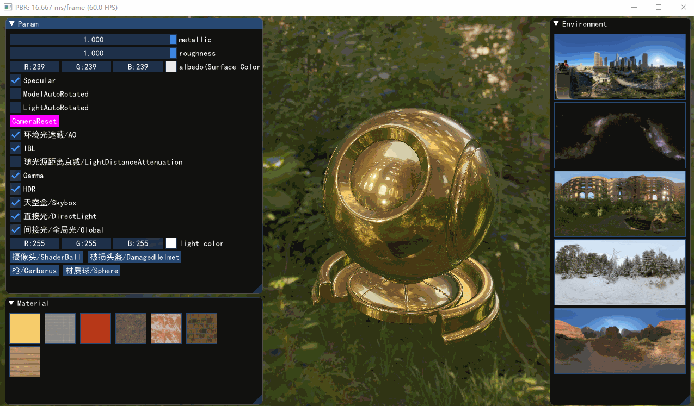

# PBR
PBR demo

* Damaged Helmet

   

* Cerberus By Andrew Maximov

   

* Shader Ball

   

* Ball

   

参考资料及部分模型/HDR资源

http://www.hdrlabs.com/test2/store/archive/PaperMill_Ruins_E/

https://www.cnblogs.com/bitzhuwei/p/specular-IBL.html

https://blog.csdn.net/poem_qianmo/article/details/85239398

https://zhuanlan.zhihu.com/p/20091064?f3fb8ead20=44d0e4ef145790c113921ea174da514f

https://learnopengl-cn.github.io/07%20PBR/03%20IBL/02%20Specular%20IBL/

https://artisaverb.info/Cerberus.html
